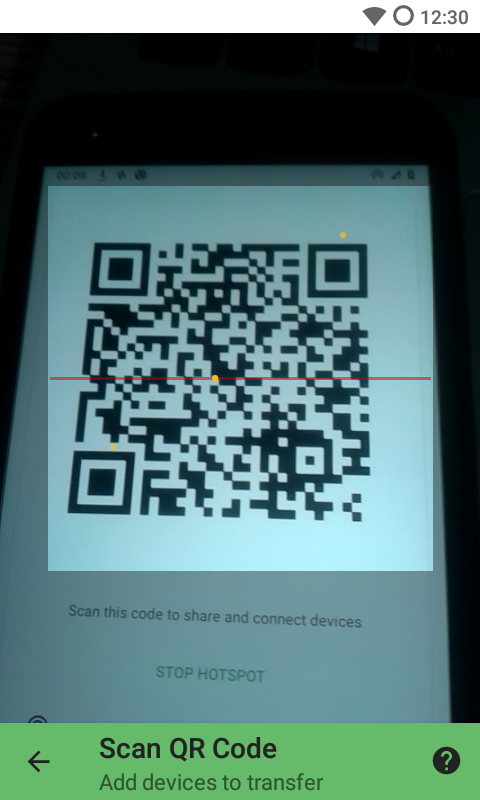

##Sharingapp/Shareit clone

## Get it on
 

## Main features
* Pause, resume and reconnect transfers
* Share large files
* Share all kinds of content, video, photo, music and app libraries
* No Internet connection is required: Set up a hotspot and connect to it using a QR code
* Share between multiple devices at the same time
* Exchange texts of any kind and save them to TrebleShot
* Share folders for backup and other purposes
* Light UI: Works faster than its rivals on low-end devices
* Speed-oriented: Minimal UI optimized for speed
* Advanced features: Network change handling, choose network based on measured speed

## Build from source
Required tools;
* Build tools: 28.0.3
* Support library: 1.0.0 - androidx
* Gradle plugin: 3.2.1
* Android Studio: 3.2.1

## Screenshots

